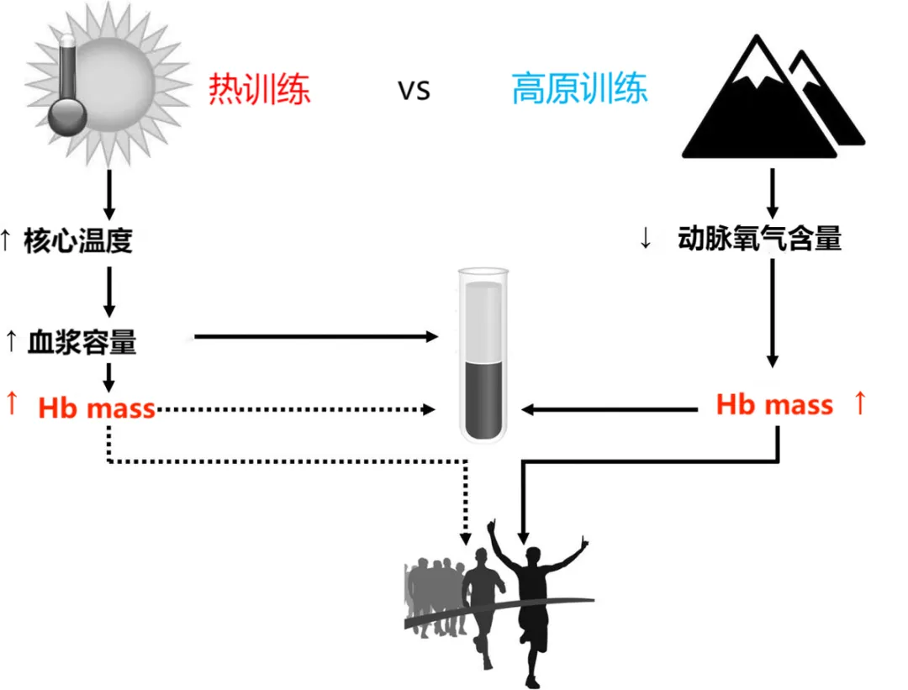

# 夏季训练

> 底层机理介绍

1. 人体散热的几种核心机制

    1. 辐射，自动进行（略）

    2. 传导，通过直接接触将热量转递给较冷的物体
        1. 由于脂肪导热性低，机体深部的热量难以传递到皮肤，所以夏天一般偏胖的人比较不耐热

    3. 对流，通过空气或液体交换热量
        1. 健身房跑步由于大多依赖于空调，空气流动性差，容易出汗严重

    4. 蒸发
        1. 不感蒸发，呼吸道等蒸发，特征为不显汗，婴儿常见
        2. 发汗

2. 成绩进步的核心原因

    1. 超负荷（跑量 + 强度）后恢复以达到一种生理适应

        1. 由于大强度容易受伤，大多推崇的是通过跑量来成长
    
> 夏季正常运动表现

1. 夏季散热需求增加，而前三种散热机制与环境温度关系密切，为了提升效率，只能更多地依赖于蒸发，血液更多地流向皮肤，因此同等强度下泵血量需要提升，即体现为心率上升

    1. 此外水分流失，血液容易变粘稠，流动性降低，心脏需要加大泵血

2. 夏季多伴随高湿，容易导致呼吸效率降低（气压低 -> 氧气分压低 -> 呼吸频率上升, 心理作用）

    1. 即夏天假设以相同的功率输出，那么由于各类损耗的影响容易导致速度降低

3. 水平低、运动年限短的人水平下降明显

> 夏季训练强度安排

1. 夏季环境适应

    1. 同等环境模拟（十天~十四天，水平越高、运动年限越长时间越短），低强度慢跑

        - 必须主动适应，即在该环境下进行运动

        - 核心原则:

            - 早晚进行，注意不要太阳直射（可以配戴帽子与墨镜）
                - 容易精神疲劳以及出现“热病”

            - 及时补水
            - 及时浇水降温
            - 及时补充电解质
                - 维持渗透压（等渗、高渗（水分过分流失，导致渗透压上升）、低渗）

2. 夏季强度安排

    1. 在夏天同等强度下 60%~80% 能达到以往 80%~90% 的效果，夏季相较以往强度应当适当降低

        - 不要追求绝对速度（大强度）

            - 夏季跑步困难但是又需要在高质量训练时追求目标配速的生理适应

                - 推荐渐进跑，在最后一段距离（3~5min）上升到目标配速
                - 常规的节奏跑难以坚持，可以适当地拆分为多组
                - 多玩一玩“速度游戏”

        - 不要追求绝对量

            - **根据身体情况调整，不要局限于课表（结构化）**
            - 出于散热需求的增加，可以对 30km 以上的长距离进行拆分，如早晚两练等

        - "Schmit等人比较高强度耐热训练和低强度耐热训练发现二者产生的热适应效果以及运动表现提高没有明显区别，但是高强度耐热训练非常容易引发功能性过量训练"

            - 功能性过量训练，合理恢复后水平依然会提升但容易出现身体和心理不适，需要格外注意恢复

    2. 坚持长期科学训练
        1. 有观点认为耐热训练和高原训练有异曲同工之妙，因为二者都能促进血红蛋白的增加

    

> 夏季饮食

清淡饮食，蔬菜水果主食 60%，肉类 40%

# 参考资料

> 视频资料

1. [冯辉跑步训练营-中长跑夏季高温训练](https://www.bilibili.com/video/BV1iG4y1t7eNttps://www.bilibili.com/video/BV1iG4y1t7eN)

2. [冯辉跑步训练营-高温条件下的中长跑训练](https://www.bilibili.com/video/BV1Hd4y1b77h)

3. [山雨小月-浅谈夏天跑步该如何科学训练](https://www.bilibili.com/video/BV1dg411Z7YT)

5. [黑影儿TV-跑步乱谈-夏训总结-[HDR]](https://www.bilibili.com/video/BV1rh411W7XK)

> 文字资料

1. [生理学-散热过程](http://drhuang.com/Chinese/health/medicine/book/%E7%94%9F%E7%90%86%E5%AD%A6/308.htm)

2. [铁三 | 赛前耐热训练与比赛注意事项](https://mp.weixin.qq.com/s/bIceFvyJR1ltdRRd3qC5Hg)

3. [高温天气的好与坏：耐热训练，启动](https://mp.weixin.qq.com/s/R-4FXs3QER_qUGaHSLHOvw) 